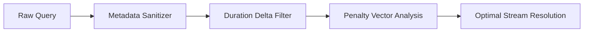

<div align="center">

# SolaceAudio

### High-Throughput Audio Ingestion & Playback Engine for Lavalink v4

<p align="center">
  <a href="https://adoptium.net"></a>
  <a href="https://github.com/lavalink-devs/Lavalink"></a>
  <a href="https://github.com/Nex-Devz/SolaceAudio/releases"></a>
  <a href="https://jitpack.io/#Nex-Devz/SolaceAudio"></a>
  <a href="LICENSE"></a>
</p>

<p align="center">
  
  
  
  
</p>

<p align="center">
  A distributed, resilient audio routing layer for high-concurrency voice nodes. Integrates deterministic candidate scoring, single-flight search deduplication, dynamic client signature rotation, and multi-platform metadata synchronization.
</p>

<p align="center">
  <a href="#system-architecture">Architecture</a> &bull;
  <a href="#source-matrix">Source Matrix</a> &bull;
  <a href="#quick-start">Quick Start</a> &bull;
  <a href="#anti-throttling-subsystems">Bypass Engine</a> &bull;
  <a href="#amazon-music-metadata-api">Amazon Music API</a> &bull;
  <a href="#scoring-pipeline">Scoring Pipeline</a> &bull;
  <a href="#credits--acknowledgements">Credits</a>
</p>

---

</div>

## System Architecture

SolaceAudio is engineered from the ground up to solve upstream rate-limiting, IP pool degradation, and track mismatch anomalies in production Discord environments:

<table>
  <thead>
    <tr>
      <th>Subsystem</th>
      <th>Technical Specification</th>
      <th>Operational Impact</th>
    </tr>
  </thead>
  <tbody>
    <tr>
      <td><b>Single-Flight Coalescing</b></td>
      <td>Concurrent duplicate query deduplication with lock-free atomic futures</td>
      <td>Eliminates upstream burst spikes during automated queue ingestion</td>
    </tr>
    <tr>
      <td><b>Deterministic Scoring</b></td>
      <td>Levenshtein distance matching, delta duration checks (±2s window), and noise token filtering</td>
      <td>Prevents covers, pitch-shifted edits, and noisy music video rips during audio mirroring</td>
    </tr>
    <tr>
      <td><b>Dynamic Client Rotation</b></td>
      <td>Automated round-robin client handshakes (Android VR Quest 2, VisionOS, Web Remix)</td>
      <td>Bypasses upstream signature throttling and eliminates HTTP 403 / 429 backpressure</td>
    </tr>
    <tr>
      <td><b>Atomic Disk Caching</b></td>
      <td>Direct zero-copy streaming coupled with transactional <code>.part</code> buffer swaps</td>
      <td>Instant subsequent playback with zero memory leak risk and zero database dependencies</td>
    </tr>
    <tr>
      <td><b>Cascade Failover</b></td>
      <td>Automated provider sequence failover (Deezer &rarr; YouTube &rarr; SoundCloud &rarr; Bandcamp)</td>
      <td>Guarantees uninterrupted audio streaming if any single upstream provider goes down</td>
    </tr>
  </tbody>
</table>

---

## Source Matrix

<div align="center">

| Provider | Ingestion Mode | Stream Output | Authentication Pipeline | Status |
| :--- | :--- | :--- | :--- | :--- |
| **Spotify** | ISRC & Metadata Mirror | 320kbps / 160kbps MP3/Opus | Nuance Metadata Schema |  |
| **YouTube** | VisionOS / Android VR / Web Remix | 160kbps Opus / AAC | PoToken & SAPISIDHASH Header |  |
| **Deezer** | Direct Stream & ISRC Audio | Up to 320kbps MP3 Direct | Public API / None Required |  |
| **JioSaavn** | Native Audio Extraction | Up to 320kbps MP4 Container | Public CDN Edge |  |
| **Gaana** | Native Chunked Stream | Master CDN HLS Transport | Public Stream Endpoint |  |
| **Amazon Music** | Metadata Cross-Resolution | High-Fidelity Mirror | Public Search Pipeline |  |
| **Pandora** | Direct Stream Resolution | Adaptive Bitrate AAC | None Required |  |
| **FloweryTTS** | Real-time Neural Synthesis | Uncompressed PCM Audio | Public API Pipeline |  |
| **Last.fm** | Contextual Recommendation Graph | Algorithmic Metadata | Optional API Key |  |

</div>

---

## Quick Start

### 1. Lavalink Node Installation

Add the plugin dependency to your `application.yml`:

```yaml
lavalink:
  plugins:
    - dependency: "com.github.Nex-Devz.SolaceAudio:solaceaudio-plugin:1.0.18"
      repository: "https://jitpack.io"
```

### 2. Comprehensive Configuration

```yaml
plugins:
  solaceaudio:
    sources:
      spotify: true
      jiosaavn: true
      gaana: true
      deezer: true
      youtube: true
      amazonmusic: true
      pandora: true
      flowerytts: true

    # Priority mirror ladder
    providers:
      - "dzisrc:{isrc}"        # Priority 1: Exact studio ISRC match on Deezer
      - "ytsearch:\"{isrc}\""  # Priority 2: Direct ISRC track search on YouTube
      - "ytsearch:{query}"     # Priority 3: Sanitized artist + title query
      - "scsearch:{query}"     # Priority 4: SoundCloud streaming fallback
      - "bcsearch:{query}"     # Priority 5: Bandcamp catalog fallback

    youtube:
      localDiskCache: true
      diskCachePath: "youtube-cache"
      maxDiskCacheMb: 10240
      cipherUrl: "https://cipher.kikkia.dev"
      cookieFile: "ytburner.txt"
      potokenUrl: "https://potoken-generator.vercel.app/token"

    spotify:
      countryCode: "US"
      playlistLoadLimit: 6
      albumLoadLimit: 6
      resolveArtistsInSearch: true

    flowerytts:
      voice: "en-US-Standard-A"
      speed: 1.0

    amazonmusic:
      apiUrl: "https://amazon-music-api-dun.vercel.app/api"
      playlistLoadLimit: 50
      albumLoadLimit: 50
      artistLoadLimit: 50
```

---

## Anti-Throttling Subsystems

### Rolling SAPISIDHASH Header Generation

For nodes hosted on hostile datacenter networks (Hetzner, OVH, DigitalOcean, Pterodactyl), provide your burner cookie in `ytburner.txt` or configure `cookieFile: "ytburner.txt"`.

SolaceAudio computes real-time cryptographic `SAPISIDHASH` headers in memory for every outgoing request to `WEB_REMIX`, ensuring uninterrupted direct audio extraction without bot challenge penalties.

### Proof-of-Origin Token (PoToken) Routing

Bypass HTTP 403 Forbidden errors and bot friction natively using dynamic auto-rotated PoTokens:

#### Managed High-Availability Endpoint
```yaml
potokenUrl: "https://potoken-generator.vercel.app/token"
```

#### Private Cluster Deployment
Deploy an isolated token generator directly to your infrastructure using our automated template:

<p align="left">
  <a href="https://vercel.com/new/clone?repository-url=https://github.com/Nex-Devz/potoken-generator">
    
  </a>
</p>

Source repository: [Nex-Devz/potoken-generator](https://github.com/Nex-Devz/potoken-generator)

---

## 🎧 Amazon Music Metadata API

SolaceAudio mirrors Amazon Music track, album, playlist, and community playlist metadata through our official high-availability serverless API adapter.

### Public Endpoint
```yaml
apiUrl: "https://amazon-music-api-dun.vercel.app/api"
```

### Self-Hosting (Optional)
Deploy your own isolated Amazon Music metadata adapter to Vercel:

<p align="left">
  <a href="https://vercel.com/new/clone?repository-url=https://github.com/Nex-Devz/amazon-music-api">
    
  </a>
</p>

Source repository: [Nex-Devz/amazon-music-api](https://github.com/Nex-Devz/amazon-music-api)

---

## Scoring Pipeline

To avoid incorrect tracks and poor audio rips, SolaceAudio runs all mirror candidates through a mathematical validation pipeline:



1. **Metadata Normalization**: Strips audio pollution tokens including `(Official Music Video)`, `[Remastered 2024]`, `4K`, `ft.`, and punctuation discrepancies.
2. **Duration Delta Validation**: Matches candidate duration against source track length. Results within a $\pm 2$ second delta receive highest confidence ranking.
3. **Penalty Vector Filtering**: Applies aggressive down-ranking penalties to terms such as `live`, `acoustic`, `cover`, `slowed`, `reverb`, and `karaoke` unless explicitly part of the source title.

---

## Management Endpoints

### Contextual Autoplay Recommendations

Query algorithmic track recommendations based on the active session player buffer:

```http
GET /v4/sessions/{sessionId}/players/{guildId}/recommendation?limit=10
```

---

## Credits & Acknowledgements

* **[saraansx](https://github.com/saraansx)** &mdash; Spotify metadata architecture and [`nuance.json`](https://gist.githubusercontent.com/saraansx/a622d4c1a12c36afdcf701201e9482a3/raw/9afe2c9c7d1a5eb3f7a05d0002a94f45b73682d0/nuance.json) reference schema.
* **[NodeLink by PerformanC](https://github.com/PerformanC/NodeLink)** &mdash; YouTube VisionOS client stream implementation concepts.
* **Official Repository** &mdash; Maintained at [`Nex-Devz/SolaceAudio`](https://github.com/Nex-Devz/SolaceAudio/).

---

## License

This project is licensed under the [Apache License, Version 2.0](LICENSE).