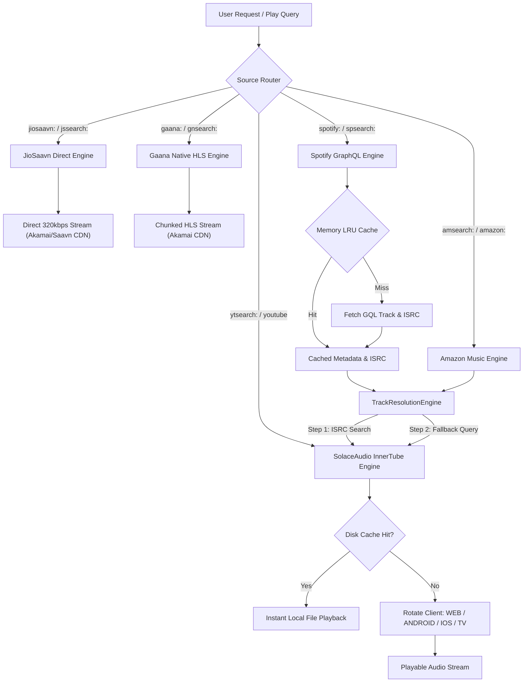

<div align="center">

# SolaceAudio

### The High-Throughput, Zero-Throttle Multi-Source Audio Engine for Lavalink v4

[](https://java.com)
[](https://github.com/lavalink-devs/Lavalink)
[](https://jitpack.io/#Nex-Devz/SolaceAudio)
[](https://discord.gg/devz)
[](LICENSE)

<p align="center">
  <b>SolaceAudio</b> is a modern, standalone audio plugin for <b>Lavalink v4</b> offering seamless, credential-free playback across Spotify, JioSaavn, Gaana, Amazon Music, Pandora, YouTube, and Last.fm. Engineered with native Java <code>HttpClient</code>, sub-millisecond LRU memory caching, and autonomous client rotation.
</p>

[Quick Start](#-quick-start) • [Supported Sources](#-supported-sources) • [Architecture](#-architecture) • [Configuration](#-configuration) • [Recommendation API](#-recommendation-api) • [Support](#-community--support)

---

</div>

## Key Highlights

- **100% Standalone or Cooperative** — Runs natively without requiring external YouTube plugins, while also capable of wrapping and enhancing official plugins if present.
- **Direct High-Fidelity Streaming** — Native 320kbps MP4 direct streaming for **JioSaavn** and chunk-buffered HLS streaming for **Gaana**.
- **Zero API Keys Required** — Enjoy full metadata, playlists, albums, and artists from Spotify and Amazon Music without developer credentials or Spotify Premium accounts.
- **ISRC-First Mirror Engine** — Matches audio using precise International Standard Recording Codes to guarantee original studio recordings (bypassing low-quality covers and live skits).
- **Sub-Millisecond LRU Memory Cache** — Resolves repeat searches in `< 1ms` with automated expiration and memory bounding.
- **Automated Disk Quota Management** — Local audio disk caching with configurable size limits (e.g. 10GB) and automatic LRU eviction.
- **ATV Counterpart Swapping** — Detects noisy YouTube music videos with skits and automatically swaps them with clean YouTube Music audio versions (`MUSIC_VIDEO_TYPE_ATV`).
- **Autonomous Multi-Client Rotation** — Automatically rotates between `WEB`, `ANDROID`, `IOS`, and `TVHTML5` InnerTube clients with cooldown tracking to bypass 429 rate limits.
- **Spring Boot 3.2+ Native** — Fully compatible with modern Lavalink REST parameter reflection.

---

## Supported Sources

| Source | Playback Type | Supported Content | Stream Quality | Auth Required |
|:---|:---:|:---|:---:|:---:|
| **Spotify** | ISRC Mirror / Preview | Tracks, Albums, Playlists, Artists, Recommendations | 320kbps / 160kbps | None |
| **JioSaavn** | Direct Native Stream | Songs, Albums, Playlists, Artists, Recommendations | Direct 320kbps MP4 | None |
| **Gaana** | Direct HLS Stream | Songs, Albums, Playlists, Artists | Native Akamai HLS | None |
| **Amazon Music** | ISRC Mirror | Tracks, Albums, Playlists, Artists | High-Fidelity Mirror | None |
| **Pandora** | Direct / Mirror | Tracks, Albums, Playlists, Artists, Stations | High-Fidelity Mirror | None |
| **YouTube** | Standalone / Enhanced | Tracks, Playlists, Searches, ATV Audio, oEmbed | Native Opus / AAC | None |
| **Last.fm** | Smart Recommendation | Scrobbler Tracks, Similar Music, Top Hits | Metadata Engine | Optional API Key |

---

## Architecture

SolaceAudio decouples metadata extraction from audio playback, providing maximum resilience against throttling, geo-blocks, and platform restrictions:



---

## Quick Start

### Option 1: Automatic Download via `application.yml` (Recommended)

Lavalink v4 automatically downloads and initializes SolaceAudio on server boot when declared in your plugin dependencies.

Add the following to your `application.yml`:

```yaml
lavalink:
  plugins:
    - dependency: "com.github.Nex-Devz:SolaceAudio:v1.0.5"
      repository: "https://jitpack.io"
```

### Option 2: Manual Installation

1. Download the latest `solaceaudio-plugin.jar` from the [Releases](https://github.com/Nex-Devz/SolaceAudio/releases/latest) page.
2. Place the jar into your Lavalink server's `plugins/` directory:
   ```text
   Lavalink/
   ├── application.yml
   ├── Lavalink.jar
   └── plugins/
       └── solaceaudio-plugin.jar
   ```
3. Restart Lavalink.

---

## Configuration

Place this configuration block inside your `application.yml`:

```yaml
server:
  port: 2333
  address: 0.0.0.0

lavalink:
  plugins:
    # SolaceAudio Plugin Dependency
    - dependency: "com.github.Nex-Devz:SolaceAudio:v1.0.5"
      repository: "https://jitpack.io"
  server:
    password: "youshallnotpass"
    sources:
      youtube: false # Disabled in core; handled natively by SolaceAudio
      bandcamp: true
      soundcloud: true
      twitch: true
      vimeo: true
      http: true
      local: false

plugins:
  solaceaudio:
    sources:
      spotify: true       # Enable Spotify playback & searches
      jiosaavn: true      # Enable JioSaavn direct streaming
      gaana: true         # Enable Gaana HLS streaming
      amazonmusic: true   # Enable Amazon Music playback
      pandora: true       # Enable Pandora playback
      youtube: true       # Enable native standalone YouTube engine
    spotify:
      market: "US"
      fallbackMarkets: ["GB", "DE", "IN"] # Auto failover for geo-restricted tracks
      playlistLoadLimit: 6
      albumLoadLimit: 6
      resolveArtistsInSearch: true
      localFiles: false
    jiosaavn:
      apiUrl: "https://saavn.dev" # Custom API proxy instance (optional)
      playlistLoadLimit: 50
    gaana:
      apiUrl: "https://gaana.com/apiv2"
      playlistLoadLimit: 6
      albumLoadLimit: 6
      artistLoadLimit: 6
    amazonmusic:
      apiUrl: ""
      playlistLoadLimit: 6
    pandora:
      searchLimit: 10
    youtube:
      localDiskCache: true
      diskCachePath: "youtube-cache"
      maxDiskCacheMb: 10240
      cipherUrl: "https://cipher.kikkia.dev"
      # Auto-rotated PoToken (Deploy 1-click free on Vercel: https://github.com/Nex-Devz/potoken-generator)
      potokenUrl: "https://your-potoken-app.vercel.app/token"
      potokenVisitorData: ""
      potoken: ""
    cache:
      maxDiskCacheMb: 10240        # Local audio disk cache cap (in MB, default: 10GB)
      maxSearchMemoryEntries: 5000  # Number of search queries to retain in memory
    lastfm:
      apiKey: ""                   # Optional Last.fm API Key for smart recommendations
```

---

## Supported Search Prefixes & URLs

### Spotify
- **Tracks / Albums / Playlists / Artists**: `https://open.spotify.com/...`
- **Track Search**: `spsearch:<query>`
- **Multi-Seed Recommendations**: `sprec:seed_tracks=<trackId>&seed_artists=<artistId>`
- **Track Preview**: `spprev:<trackId>`

### JioSaavn
- **Direct URLs**: `https://www.jiosaavn.com/song/...`, `https://www.jiosaavn.com/album/...`
- **Track Search**: `jssearch:<query>`
- **Recommendations**: `jsrec:<songId>`

### Gaana
- **Direct URLs**: `https://gaana.com/song/...`, `https://gaana.com/album/...`
- **Track Search**: `gnsearch:<query>` or `gaanasearch:<query>`
- **Recommendations**: `gnrec:<seokey>`

### Amazon Music
- **Direct URLs**: `https://music.amazon.com/albums/...`, `https://music.amazon.com/tracks/...`
- **Track Search**: `amsearch:<query>`

### Pandora
- **Direct URLs**: `https://www.pandora.com/artist/...`, `https://www.pandora.com/station/...`

### YouTube
- **Direct URLs**: `https://www.youtube.com/watch?v=...`, `https://youtu.be/...`, `https://music.youtube.com/...`
- **Playlists**: `https://www.youtube.com/playlist?list=...`
- **Track Search**: `ytsearch:<query>`
- **Music Search**: `ytmsearch:<query>`

---

## Recommendation API

SolaceAudio exposes a REST endpoint for intelligent autoplay suggestions based on the currently playing track context:

```http
GET /v4/sessions/{sessionId}/players/{guildId}/recommendation?limit=10
```

### Parameters

| Parameter | Type | Required | Description |
|:---|:---:|:---:|:---|
| `sessionId` | `String` | Yes | Active Lavalink session ID |
| `guildId` | `String` | Yes | Target Discord guild / player ID |
| `limit` | `Integer` | No | Number of recommendations to retrieve (Default: `10`) |
| `track` | `String` | No | Base64 encoded track to use as seed (defaults to currently playing track) |

### Sample Response

```json
{
  "source": "spotify",
  "seed": "Blinding Lights - The Weeknd",
  "total": 10,
  "tracks": [
    {
      "encoded": "QAAAmAIACFNwb3RpZnkAAAA...",
      "info": {
        "identifier": "0VjIjW4GlUZAMYd2vXMi3b",
        "author": "The Weeknd",
        "length": 200040,
        "isStream": false,
        "title": "Save Your Tears",
        "uri": "https://open.spotify.com/track/0VjIjW4GlUZAMYd2vXMi3b",
        "sourceName": "spotify"
      }
    }
  ]
}
```

---

## Building from Source

To compile SolaceAudio locally:

```bash
# Clone the repository
git clone https://github.com/Nex-Devz/SolaceAudio.git
cd SolaceAudio

# Build with Gradle wrapper
./gradlew clean build -x test
```

The compiled plugin jar will be generated at:
`plugin/build/libs/solaceaudio-plugin-dev.jar`

---

## Community & Support

Join our official Discord community for assistance, release notifications, and feature requests:

<div align="center">

[](https://discord.gg/devz)

<b>Support Server: <a href="https://discord.gg/devz">discord.gg/devz</a></b>

---

<sub>Built and maintained with care by <a href="https://github.com/Nex-Devz">Nex Devz</a> • Licensed under the <a href="LICENSE">Apache 2.0 License</a></sub>

</div>